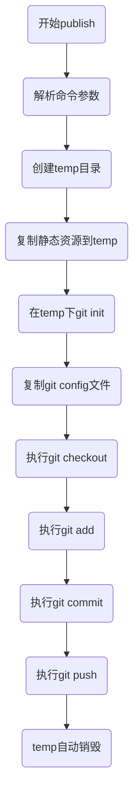

# rust实现一个gh-pages工具


`nodejs`有个`gh-pages`包，可以把项目里的某个文件夹发布到`gh-pages`非常方便，因此想用rust实现一个版本，对于rust生态的用户来说，多一个选择。这样使用`mdbook`和`gh_page_tool`可以非常方便的管理自己的博客。
完整代码在github，[gh_page_tool地址](https://github.com/maochunguang/gh-page-tool)。

<!-- more -->

## 实现原理分析
`gh_page_tool`使用的时候只有一个命令，`gh_page_tool publish -d book -b gh-pages`，这个命令行工具，有两个参数`-d`和`-b`，
1. `-d`代表静态博客的目录，默认值是book，这个是mdbook的默认输出目录
2. `-b`代表发到github的哪个分支，默认是gh-pages分支，这是github的gh-pages功能的分支。

### 方案选择
从上面的使用方式可以看出，这个命令行就是把某个目录文件，推送到远程的`gh-pages`分支。
* `方案一`、在当前目录进行操作，调用git的命令进行commit和push。
  * 优点：实现起来简单
  * 缺点：容易对源项目的提交和内容产生影响
* `方案二`、创建一个临时目录，把内容复制到临时目录，在临时目录操作，最后删除临时目录。
  * 优点：对原项目无干扰，
  * 缺点：实现复杂，性能会慢一点点，但对于rust来说不是问题。
  综合来看，个人感觉对于原项目不能造成干扰，做好一个工具应该做的事情，因此选用`方案二`。

### 流程图
下面是一个publish命令的简单执行流程。



## 开始实现功能

### 步骤 1：创建`Rust`项目

首先，创建一个新的 Rust 项目：

```bash
cargo new gh_page_tool
cd gh_page_tool
```

### 步骤 2：添加依赖并配置

在项目的 `Cargo.toml` 文件中添加如下依赖。
1. `clap`是用来构建命令行工具的。
2. `fs_extra`是用来复制文件夹，简化操作。
3. `tempfile`是创建临时文件，支持自动销毁。

```toml
[dependencies]
clap = "4.4.0"
fs_extra = "1.2.0" 
tempfile = "3.2.0"
```

然后运行 `cargo build` 以安装依赖项。

### 步骤 3：解析命令行参数

在 `src/main.rs` 中，使用 `clap` 来构建命令行接口并解析参数：

```rust
use clap::{arg, Command};
mod publish_lib;
fn main() {
    let matches = Command::new("gh_page")
        .version("1.0")
        .author("tommy")
        .about("Implements gh-pages like functionality")
        .subcommand(
            Command::new("publish")
                .about("Publishes a directory to a gh-pages branch")
                .arg(arg!(-d --directory <DIRECTORY> "Sets the directory to publish"))
                .arg(arg!(-b --branch <BRANCH> "Sets the branch to publish to"))
        )
        .get_matches();

    if let Some(matches) = matches.subcommand_matches("publish") {
        let default_dir = String::from("book");
        let default_branch = String::from("gh-pages");
        let directory = matches.get_one::<String>("directory").unwrap_or(&default_dir);
        let branch = matches.get_one::<String>("branch").unwrap_or(&default_branch);
        publish_lib::publish(directory, branch);
    }
}
```

### 步骤 4：实现publish功能

实现 `publish` 函数以完成推送工作。
这里有几个点需要注意：
1. 复制文件到temp时，复制的是整个`book`文件夹，后面执行git操作需要到`book`目录下面。
2. 复制git config文件需要在git init之后，要不然config文件会覆盖。
3. 复制过git config文件后，需要切换到git项目的目录，防止因为路径出问题。
4. `dest_path = dest_path.join(directory);`是把目录切换到`book`目录。

```rust
use std::fs;
use std::path::Path;
use std::process::Command;
use tempfile::TempDir;

pub(crate) fn publish(directory: &str, branch: &str) {
    // 创建临时目录
    let temp_dir = TempDir::new_in(".").expect("Failed to create temp directory");
    let temp_dir_path = temp_dir.path();
    let source_path: &Path = Path::new(directory);
    // 确保目录存在
    if !source_path.exists() {
        panic!("Directory :{} does not exist", directory);
    }

    // 复制文件到临时目录
    // 这里我们假设 `directory` 是一个文件夹路径
    let mut dest_path = temp_dir_path.join("gh_page_content");
    // 目录不存在，创建目录
    let _ = fs::create_dir_all(&dest_path)
        .map(|_| println!("created temp dir {} Success", dest_path.to_str().unwrap()));
    if !dest_path.exists() {
        panic!("Directory :{} does not exist", dest_path.to_str().unwrap());
    }

    // 复制 .git 配置到临时目录
    let git_config_path = Path::new(".git/config");

    copy_dir_all(&source_path, &dest_path);
    
    // 切换到book目录
    dest_path = dest_path.join(directory);
    // 在临时目录中进行 Git 操作
    // 初始化 Git 仓库
    let status = Command::new("git")
        .args(&["init"])
        .current_dir(&dest_path)
        .status()
        .expect("Failed to initialize git");
    if !status.success() {
        panic!("Failed to initialize git repository");
    }
    println!("git init success!");

    // 复制 .git 配置到临时目录
    if git_config_path.exists() {
        let target_config_path = dest_path.join(".git/config");
        println!(
            "git copy config start  source:{} , target:{}",
            git_config_path.to_str().unwrap(),
            target_config_path.to_str().unwrap()
        );

        fs::copy(git_config_path, target_config_path).expect("Failed to copy .git/config");
        println!("git copy config success!");
    } else {
        panic!("No .git/config found in the root directory");
    }
    
    // 切换到临时目录
    std::env::set_current_dir(&dest_path).expect("Failed to change to temp directory");

    let status = Command::new("git")
        .args(&["checkout", "-b", branch])
        .status()
        .expect("Failed to checkout branch");
    if !status.success() {
        panic!("Failed to  checkout branch: {}", branch);
    }
    println!("git checkout {} success!", branch);
    
    // 以此类推，添加 git add, git commit 和 git push 的操作
    // ......    

   
    // 退出临时目录
    // 临时目录将在 `temp_dir` 变量离开作用域时自动删除
    let _ = temp_dir.close().expect("drop temp dir failed!");
}

// 递归复制目录
fn copy_dir_all(src: &Path, dst: &Path) {
    let options = fs_extra::dir::CopyOptions::new(); // 默认选项
    fs_extra::dir::copy(src, dst, &options).expect("Failed to copy directory");
    println!("copy_dir_all to temp success!");
}

```


如果想给命令行工具发布到cargo，开源参考我的两个文章。
1. 发布到crate教程： https://zhuanlan.zhihu.com/p/668756184
2. 支持代码提示教程：https://zhuanlan.zhihu.com/p/669543058
### 步骤 5：copy命令行工具
```bash
cargo build
cp target/debug/gh_page_tool ~/.cargo/bin/
```

### 步骤 6：验证成果
找个`mdbook`的测试项目，或者`gitbook`的，在项目根目录执行 `gh_page_tool publish -d book -b gh-pages`。


## 参考文档
1. gh-pages插件：https://www.npmjs.com/package/gh-pages
2. clap包：https://docs.rs/clap/4.4.0/clap/index.html